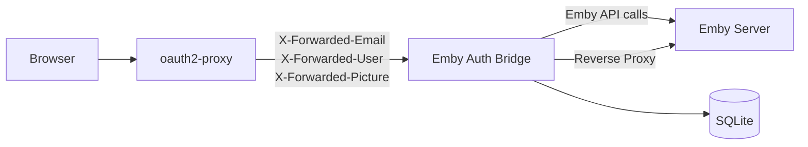
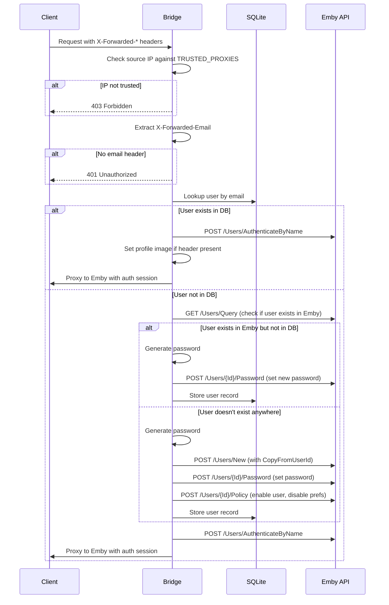
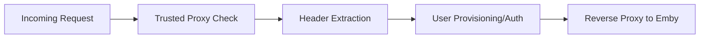

# Design Document

## Overview

The Emby Authentication Bridge is a lightweight Go service that sits between oauth2-proxy and Emby Server. It reads OIDC session headers set by oauth2-proxy, auto-provisions users in Emby, authenticates them transparently, and proxies requests to the Emby web interface. It also serves a simple account page where users can view their generated credentials for TV/mobile apps.

The service compiles to a single static binary with no runtime dependencies. It uses Go's standard library for HTTP handling, reverse proxying, and template rendering, with a pure-Go SQLite driver for persistence. Deployed as a minimal Docker image (~10-15MB), it runs with a low memory footprint (~10-20MB at runtime).

### Key Design Decisions

- **Go stdlib `net/http`** as the HTTP server — no external framework needed, production-ready out of the box
- **Go stdlib `net/http/httputil.ReverseProxy`** for proxying requests to Emby — handles hop-by-hop headers, supports Director pattern
- **`zombiezen.com/go/sqlite`** (or `modernc.org/sqlite`) for pure-Go SQLite — no CGO required, single binary deployment
- **Go stdlib `html/template`** for the account page — secure by default (auto-escaping), no template engine dependency
- **Go stdlib `log/slog`** for structured logging — JSON output, leveled logging, zero dependencies
- **Plaintext password storage** — passwords are not security-critical (8-char alphanumeric for TV remotes)
- **No session state** — each request is self-contained; auth state comes from forwarded headers
- **Template user via Emby's native CopyFromUserId** — avoids reimplementing policy/config copying
- **Single static binary** — no runtime dependencies, trivial deployment, minimal attack surface

## Architecture



### Request Flow



### Route Structure

| Route | Method | Purpose |
|-------|--------|---------|
| `/health` | GET | Health check (DB + Emby connectivity) |
| `/account` | GET | Account page showing credentials |
| `/*` | ALL | Reverse proxy to Emby (after auth middleware) |

### Middleware Chain



The middleware chain is composed using standard `http.Handler` wrapping:

```go
handler := trustedProxy(extractHeaders(authenticate(proxyHandler)))
```

## Components and Interfaces

### Module Structure

```
cmd/bridge/main.go              # Entry point, server startup, config validation
internal/config/config.go       # Env var loading and validation
internal/emby/client.go         # Emby API client (net/http)
internal/db/sqlite.go           # Database operations (zombiezen.com/go/sqlite)
internal/middleware/proxy.go    # Trusted proxy IP check
internal/middleware/auth.go     # Header extraction + user provisioning/auth
internal/handler/health.go      # Health check endpoint
internal/handler/account.go     # Account page (html/template)
internal/handler/proxy.go       # Reverse proxy to Emby (httputil.ReverseProxy)
internal/password/gen.go        # Password generation
```

### Component Interfaces

```go
// internal/config/config.go

package config

import "net"

// Config holds all application configuration loaded from environment variables.
type Config struct {
    EmbyAPIURL       string       // EMBY_API_URL
    EmbyAPIKey       string       // EMBY_API_KEY
    TemplateUserName string       // TEMPLATE_USER_NAME
    TrustedProxies   []*net.IPNet // TRUSTED_PROXIES (parsed CIDR/IPs)
    BridgePort       int          // BRIDGE_PORT (default: 8080)
    DatabasePath     string       // DATABASE_PATH (default: ./data/users.db)
}

// Load reads configuration from environment variables.
// Returns an error naming the specific missing variable if a required var is absent.
func Load() (*Config, error)

// ParseTrustedProxies parses a comma-separated list of IPs/CIDRs into []*net.IPNet.
func ParseTrustedProxies(raw string) ([]*net.IPNet, error)
```

```go
// internal/emby/client.go

package emby

import (
    "context"
    "net/http"
)

// User represents an Emby user record from the API.
type User struct {
    ID   string
    Name string
    Policy *UserPolicy
}

// UserPolicy represents Emby user policy fields.
type UserPolicy struct {
    IsDisabled                  bool
    EnableUserPreferenceAccess  bool
}

// AuthResult represents a successful authentication response.
type AuthResult struct {
    AccessToken string
    User        User
    ServerID    string
}

// Client wraps all Emby REST API interactions.
type Client struct {
    baseURL    string
    apiKey     string
    httpClient *http.Client
}

// NewClient creates a new Emby API client.
func NewClient(baseURL, apiKey string) *Client

func (c *Client) FindUserByName(ctx context.Context, name string) (*User, error)
func (c *Client) CreateUser(ctx context.Context, name, copyFromUserID string) (*User, error)
func (c *Client) AuthenticateByName(ctx context.Context, username, password string) (*AuthResult, error)
func (c *Client) UpdatePassword(ctx context.Context, userID, newPassword string) error
func (c *Client) UpdatePolicy(ctx context.Context, userID string, policy *UserPolicy) error
func (c *Client) SetProfileImage(ctx context.Context, userID string, imageURL string) error
func (c *Client) Ping(ctx context.Context) error
```

```go
// internal/db/sqlite.go

package db

import "time"

// UserRecord represents a row in the users table.
type UserRecord struct {
    Email      string
    EmbyUserID string
    Password   string
    CreatedAt  time.Time
}

// DB wraps SQLite database operations.
type DB struct { /* ... */ }

// Open opens (or creates) the SQLite database at the given path and initializes the schema.
func Open(path string) (*DB, error)

func (d *DB) FindUser(email string) (*UserRecord, error)
func (d *DB) InsertUser(email, embyUserID, password string) error
func (d *DB) IsHealthy() bool
func (d *DB) Close() error
```

```go
// internal/password/gen.go

package password

// Generate returns a random 8-character password consisting of [a-z0-9].
func Generate() string
```

```go
// internal/middleware/proxy.go

package middleware

import (
    "net"
    "net/http"
)

// TrustedProxy returns middleware that rejects requests from IPs not in the trusted list.
func TrustedProxy(trusted []*net.IPNet) func(http.Handler) http.Handler

// IsIPTrusted checks whether an IP is contained in any of the trusted networks.
func IsIPTrusted(ip net.IP, trusted []*net.IPNet) bool
```

```go
// internal/middleware/auth.go

package middleware

import "net/http"

// OIDCHeaders holds extracted OIDC session headers.
type OIDCHeaders struct {
    Email      string
    DisplayName string
    PictureURL  string
}

// Auth returns middleware that extracts headers, provisions users, and authenticates with Emby.
func Auth(embyClient *emby.Client, database *db.DB) func(http.Handler) http.Handler
```

```go
// internal/handler/health.go

package handler

import "net/http"

// Health returns an http.HandlerFunc for the /health endpoint.
func Health(database *db.DB, embyClient *emby.Client) http.HandlerFunc
```

```go
// internal/handler/account.go

package handler

import "net/http"

// Account returns an http.HandlerFunc for the /account endpoint.
// Renders an HTML page showing the user's email and password.
func Account(database *db.DB) http.HandlerFunc
```

```go
// internal/handler/proxy.go

package handler

import "net/http"

// Proxy returns an http.Handler that reverse-proxies requests to Emby.
func Proxy(embyURL string) http.Handler
```

### Emby API Client Design

The Emby API client wraps all Emby REST API interactions using Go's `net/http` package. It uses the API key for admin operations and constructs the `X-Emby-Authorization` header for user authentication.

**Authentication header format:**
```
Emby Client="EmbyAuthBridge", Device="Server", DeviceId="emby-auth-bridge", Version="1.0.0"
```

**API Key usage:** Passed as query parameter `?api_key={key}` for admin endpoints (user creation, policy updates, password changes).

**Retry logic:** None. Emby API calls are not retried — if a call fails, the error is logged and returned immediately. This keeps the code simple and avoids masking persistent failures.

**Endpoints used:**

| Operation | Method | Endpoint | Auth |
|-----------|--------|----------|------|
| Find user | GET | `/Users/Query` | API key |
| Create user | POST | `/Users/New` | API key |
| Authenticate | POST | `/Users/AuthenticateByName` | X-Emby-Authorization header |
| Update password | POST | `/Users/{Id}/Password` | API key |
| Update policy | POST | `/Users/{Id}/Policy` | API key |
| Set profile image | POST | `/Users/{Id}/Images/Primary` | API key |
| Health check | GET | `/System/Info` | API key |

**Profile image flow:** The Bridge fetches the image from the URL in `X-Forwarded-Picture` using `net/http`, reads the bytes, and POSTs them to Emby's image endpoint as `application/octet-stream`.

## Data Models

### SQLite Schema

```sql
CREATE TABLE IF NOT EXISTS users (
  email TEXT PRIMARY KEY,
  emby_user_id TEXT NOT NULL,
  password TEXT NOT NULL,
  created_at TEXT NOT NULL DEFAULT (datetime('now'))
);
```

### Emby API Request/Response Models

**POST /Users/New — CreateUserByName:**
```json
{
  "Name": "user@example.com",
  "CopyFromUserId": "<template-user-id>",
  "UserCopyOptions": ["UserPolicy", "UserConfiguration"]
}
```

**POST /Users/AuthenticateByName:**
```json
{
  "Username": "user@example.com",
  "Pw": "abc12def"
}
```

Response:
```json
{
  "AccessToken": "...",
  "User": { "Id": "...", "Name": "..." },
  "ServerId": "..."
}
```

**POST /Users/{Id}/Password — UpdateUserPassword:**
```json
{
  "Id": "<user-id>",
  "NewPw": "abc12def",
  "ResetPassword": true
}
```

**POST /Users/{Id}/Policy — UserPolicy (partial):**
```json
{
  "IsDisabled": false,
  "EnableUserPreferenceAccess": false
}
```

**POST /Users/{Id}/Images/Primary:**
- Content-Type: `application/octet-stream`
- Body: raw image bytes (fetched from X-Forwarded-Picture URL)

### Go Struct Mappings

```go
// Request/response structs for JSON marshaling

type createUserRequest struct {
    Name            string   `json:"Name"`
    CopyFromUserID  string   `json:"CopyFromUserId"`
    UserCopyOptions []string `json:"UserCopyOptions"`
}

type authenticateRequest struct {
    Username string `json:"Username"`
    Pw       string `json:"Pw"`
}

type authenticateResponse struct {
    AccessToken string   `json:"AccessToken"`
    User        userJSON `json:"User"`
    ServerID    string   `json:"ServerId"`
}

type userJSON struct {
    ID     string          `json:"Id"`
    Name   string          `json:"Name"`
    Policy *userPolicyJSON `json:"Policy,omitempty"`
}

type userPolicyJSON struct {
    IsDisabled                 bool `json:"IsDisabled"`
    EnableUserPreferenceAccess bool `json:"EnableUserPreferenceAccess"`
}

type updatePasswordRequest struct {
    ID            string `json:"Id"`
    NewPw         string `json:"NewPw"`
    ResetPassword bool   `json:"ResetPassword"`
}
```

### Environment Variables

| Variable | Required | Default | Description |
|----------|----------|---------|-------------|
| `EMBY_API_URL` | Yes | — | Emby server URL (e.g., `http://emby:8096/emby`) |
| `EMBY_API_KEY` | Yes | — | Emby admin API key |
| `TEMPLATE_USER_NAME` | Yes | — | Name of the template user in Emby |
| `TRUSTED_PROXIES` | Yes | — | Comma-separated IPs/CIDRs |
| `BRIDGE_PORT` | No | `8080` | Port the Bridge listens on |
| `DATABASE_PATH` | No | `./data/users.db` | Path to SQLite database file |

## Correctness Properties

*A property is a characteristic or behavior that should hold true across all valid executions of a system — essentially, a formal statement about what the system should do. Properties serve as the bridge between human-readable specifications and machine-verifiable correctness guarantees.*

### Property 1: Password format invariant

*For any* generated password, it SHALL be exactly 8 characters long and consist only of lowercase letters (a-z) and digits (0-9) — matching the regex `^[a-z0-9]{8}$`.

**Validates: Requirements 3.1**

### Property 2: Trusted proxy IP matching

*For any* IP address and any trusted proxy list (containing IPs and/or CIDR ranges), the IP SHALL be accepted if and only if it matches at least one entry in the list (exact match for IPs, subnet containment for CIDRs).

**Validates: Requirements 1.2**

### Property 3: Database user record round-trip

*For any* valid user record (email, emby_user_id, password), inserting it into the database and then querying by email SHALL return a record with identical email, emby_user_id, and password values.

**Validates: Requirements 3.4, 9.3**

### Property 4: Password stability

*For any* user that already exists in the database, subsequent lookups SHALL always return the same password that was originally stored — the password is never regenerated or modified.

**Validates: Requirements 3.6**

### Property 5: Account page credential display

*For any* authenticated user with a record in the database, the rendered account page SHALL contain both the user's email address and their stored plaintext password.

**Validates: Requirements 8.1, 8.2**

### Property 6: Missing config error reporting

*For any* required environment variable that is missing at startup, the error message SHALL name the specific missing variable.

**Validates: Requirements 11.7**

## Error Handling

### Error Categories and Responses

| Error Scenario | HTTP Response | Behavior |
|---------------|--------------|----------|
| Request from untrusted IP | 403 Forbidden | Reject immediately, log source IP |
| Missing X-Forwarded-Email | 401 Unauthorized | Reject, no further processing |
| Emby API unreachable | 503 Service Unavailable | Log and return |
| Emby API 4xx error | 500 Internal Server Error | Log and return error |
| Emby API 5xx error | 503 Service Unavailable | Log and return |
| User creation failure | 500 Internal Server Error | Log failure reason |
| Database error | 500 Internal Server Error | Log operation and error |
| Auth failure | 401 Unauthorized | Log and return |
| Profile image update failure | — (continue) | Log and proceed with login |
| Policy update failure | — (continue) | Log and proceed with login |

### No Retry Logic

Emby API calls are not retried. If a call fails, the error is logged and an appropriate HTTP response is returned immediately. This keeps the codebase simple and avoids masking persistent failures. If Emby is temporarily unavailable, the user can simply refresh.

### Non-blocking Failures

Profile image sync and policy updates are non-blocking — if they fail, the login flow continues. These are logged as warnings via `slog.Warn` but do not prevent the user from accessing Emby.

### Startup Validation

The Bridge validates at startup:
1. All required environment variables are present (error names the missing variable)
2. SQLite database is accessible and schema is initialized
3. Template user exists in Emby (via API lookup)

If any validation fails, the process exits with a non-zero code and a descriptive error message via `log.Fatal`.

### Error Wrapping

Errors are wrapped with context using `fmt.Errorf("operation: %w", err)` to provide clear error chains for debugging. The `errors.Is` and `errors.As` functions are used for error inspection.

## Testing Strategy

### Property-Based Tests (pgregory.net/rapid)

The project uses [rapid](https://pgregory.net/rapid) for property-based testing in Go. Each property test runs a minimum of 100 iterations.

Properties to test:

1. **Password generation** — format invariant across many generations
2. **IP/CIDR matching** — correctness of accept/reject logic across random IPs and proxy lists
3. **Database round-trip** — insert/retrieve consistency
4. **Password stability** — idempotence across repeated lookups
5. **Account page rendering** — credential presence in output
6. **Config validation** — error messages name missing variables

Each test is tagged with: `Feature: emby-auth-bridge, Property {N}: {description}`

Example property test structure:

```go
package password_test

import (
    "regexp"
    "testing"

    "pgregory.net/rapid"

    "github.com/example/emby-auth-bridge/internal/password"
)

// Feature: emby-auth-bridge, Property 1: Password format invariant
func TestPasswordFormatInvariant(t *testing.T) {
    re := regexp.MustCompile(`^[a-z0-9]{8}$`)
    rapid.Check(t, func(t *rapid.T) {
        pw := password.Generate()
        if !re.MatchString(pw) {
            t.Fatalf("password %q does not match format", pw)
        }
    })
}
```

```go
package middleware_test

import (
    "net"
    "testing"

    "pgregory.net/rapid"

    "github.com/example/emby-auth-bridge/internal/middleware"
)

// Feature: emby-auth-bridge, Property 2: Trusted proxy IP matching
func TestTrustedProxyIPMatching(t *testing.T) {
    rapid.Check(t, func(t *rapid.T) {
        // Generate a random CIDR
        prefix := rapid.IntRange(8, 28).Draw(t, "prefix")
        baseIP := net.IPv4(
            byte(rapid.IntRange(1, 254).Draw(t, "oct1")),
            byte(rapid.IntRange(0, 254).Draw(t, "oct2")),
            byte(rapid.IntRange(0, 254).Draw(t, "oct3")),
            byte(rapid.IntRange(0, 254).Draw(t, "oct4")),
        )
        _, network, _ := net.ParseCIDR(baseIP.String() + "/" + fmt.Sprint(prefix))
        trusted := []*net.IPNet{network}

        // Generate a random IP
        testIP := net.IPv4(
            byte(rapid.IntRange(1, 254).Draw(t, "tip1")),
            byte(rapid.IntRange(0, 254).Draw(t, "tip2")),
            byte(rapid.IntRange(0, 254).Draw(t, "tip3")),
            byte(rapid.IntRange(0, 254).Draw(t, "tip4")),
        )

        result := middleware.IsIPTrusted(testIP, trusted)
        expected := network.Contains(testIP)

        if result != expected {
            t.Fatalf("IsIPTrusted(%v, %v) = %v, want %v", testIP, network, result, expected)
        }
    })
}
```

```go
package db_test

import (
    "testing"

    "pgregory.net/rapid"

    "github.com/example/emby-auth-bridge/internal/db"
)

// Feature: emby-auth-bridge, Property 3: Database user record round-trip
func TestDatabaseRoundTrip(t *testing.T) {
    database, _ := db.Open(":memory:")
    defer database.Close()

    rapid.Check(t, func(t *rapid.T) {
        email := rapid.StringMatching(`[a-z]{3,10}@[a-z]{3,8}\.[a-z]{2,4}`).Draw(t, "email")
        userID := rapid.StringMatching(`[a-f0-9]{32}`).Draw(t, "userID")
        password := rapid.StringMatching(`[a-z0-9]{8}`).Draw(t, "password")

        err := database.InsertUser(email, userID, password)
        if err != nil {
            t.Fatalf("insert failed: %v", err)
        }

        record, err := database.FindUser(email)
        if err != nil {
            t.Fatalf("find failed: %v", err)
        }

        if record.Email != email || record.EmbyUserID != userID || record.Password != password {
            t.Fatalf("round-trip mismatch: got %+v", record)
        }
    })
}
```

### Unit Tests (Go stdlib testing)

Example-based tests for:
- Header extraction (valid/missing/malformed headers)
- Authentication flow branching (existing user, new user, adopted user)
- Health check responses (healthy, DB down, Emby down)
- Error response formatting
- Config parsing edge cases

### Integration Tests

- Full request flow with mocked Emby API (`net/http/httptest`)
- Database operations with real SQLite (in-memory via `:memory:`)
- Reverse proxy behavior verification

### Test Configuration

- Framework: Go stdlib `testing`
- PBT library: `pgregory.net/rapid`
- HTTP mocking: `net/http/httptest`
- Database: in-memory SQLite for unit/integration tests (`:memory:`)
- Minimum PBT iterations: 100 (rapid's default is 100)
- Run tests: `go test ./...`

### Docker Build

```dockerfile
# Build stage
FROM golang:1.23-alpine AS builder
WORKDIR /app
COPY go.mod go.sum ./
RUN go mod download
COPY . .
RUN CGO_ENABLED=0 GOOS=linux go build -ldflags="-s -w" -o /bridge ./cmd/bridge

# Final stage
FROM gcr.io/distroless/static-debian12:nonroot
COPY --from=builder /bridge /bridge
EXPOSE 8080
ENTRYPOINT ["/bridge"]
```

- Final image: ~10-15MB (static binary + distroless base)
- No runtime dependencies
- Runs as non-root user
- No shell, no package manager — minimal attack surface

### Dependencies (go.mod)

```
module github.com/example/emby-auth-bridge

go 1.23

require (
    zombiezen.com/go/sqlite v1.4.0
)

require (
    pgregory.net/rapid v1.1.0 // test-only
)
```

All other functionality uses Go's standard library:
- `net/http` — HTTP server and client
- `net/http/httputil` — reverse proxy
- `html/template` — account page rendering
- `log/slog` — structured logging
- `net` — IP/CIDR parsing
- `crypto/rand` — secure random password generation
- `encoding/json` — JSON marshaling for Emby API
- `database/sql`-style access via the sqlite package
